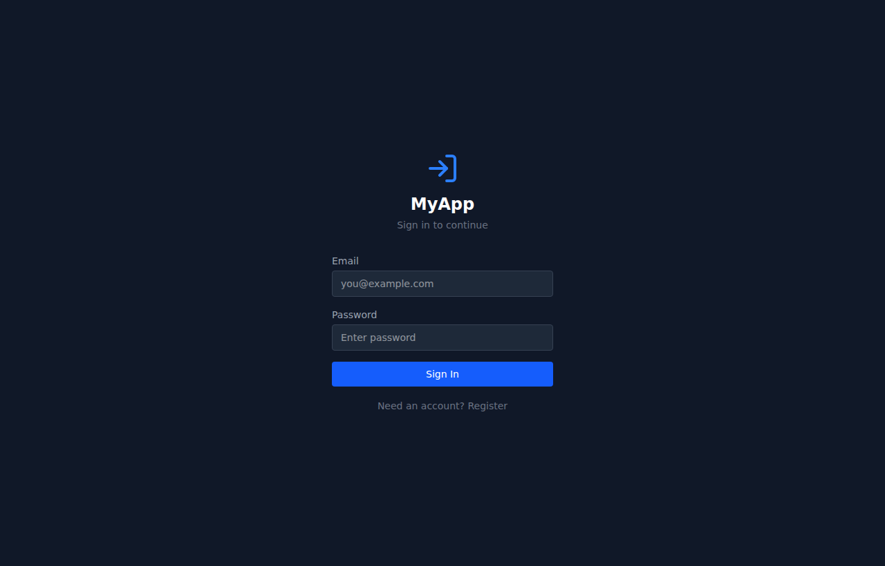

# docker-fullstack-template

Go from `git clone` to a running full-stack application with authentication, an example CRUD resource, and a CI/CD pipeline in under two minutes. Built as a standalone, synthetic-data demo, modeled on the kind of system I build for clients.



## Quick Start

```bash
# 1. Clone and configure
git clone https://github.com/HenryLabsConsulting/docker-fullstack-template.git
cd docker-fullstack-template
cp .env.example .env

# 2. Start all services
docker compose up --build
```

You'll see three containers start: `db`, `backend`, and `frontend`. Wait for `frontend-1 | VITE vX.X.X ready` in the logs.

In a second terminal:

```bash
# 3. Initialize the database
docker compose exec backend flask db upgrade

# 4. Load sample data
docker compose exec backend python seed.py
```

Open [http://localhost:5173](http://localhost:5173) and log in:

- **Admin:** `admin@example.com` / `admin123`
- **User:** `user@example.com` / `user123`

You should see a dashboard with a sidebar, header, and an Items page where you can create, edit, and delete items. Each user only sees their own data.

## Architecture

```
                          Dev Environment
┌──────────┐      ┌──────────────────┐      ┌──────────────┐      ┌─────────────────┐
│          │      │    Frontend      │      │   Backend    │      │  PostgreSQL 16  │
│ Browser  │─────▶│  React + Vite   │─────▶│ Flask + JWT  │─────▶│   (Alpine)      │
│          │      │  :5173          │      │ :5000        │      │   :5432         │
└──────────┘      └──────────────────┘      └──────────────┘      └─────────────────┘
                         │                         │
                    Bind mount              Bind mount
                   (hot reload)            (auto restart)

                          CI/CD Pipeline
┌──────────────┐      ┌────────────────┐      ┌──────────────────────────────┐
│  Push to     │─────▶│ GitHub Actions │─────▶│ Production Server            │
│  main        │      │ lint + deploy  │      │ SSH → pull → rebuild → test  │
└──────────────┘      └────────────────┘      └──────────────────────────────┘

                          Production
┌──────────┐      ┌──────────────┐      ┌──────────────┐      ┌─────────────────┐
│ Browser  │─────▶│ Nginx (SSL)  │─────▶│  Gunicorn    │─────▶│  PostgreSQL 16  │
│          │      │ :443         │      │  Flask app   │      │  :5432          │
└──────────┘      └──────────────┘      │ + static     │      └─────────────────┘
                                        └──────────────┘
```

## Tech Stack

| Layer | Technology | Version | Rationale |
|-------|-----------|---------|-----------|
| Backend | Flask + SQLAlchemy | Flask 3.1, SQLAlchemy 3.1 | Lightweight, explicit, production-proven |
| Auth | Flask-JWT-Extended + bcrypt | JWT 4.7, Bcrypt 1.0 | Token-based, stateless, extensible |
| Migrations | Flask-Migrate (Alembic) | 4.0 | Schema versioning with upgrade/downgrade |
| Frontend | React + TypeScript | React 19, TS 5.9 | Component model with full type safety |
| Build | Vite | 8.0 | Sub-second HMR, native ES modules |
| Styling | Tailwind CSS | 4.2 | Utility-first, no CSS file management |
| Database | PostgreSQL (Alpine) | 16 | The standard for production applications |
| Container | Docker Compose | 3.8 spec | One command to run the full stack |
| CI | GitHub Actions | - | Lint + type check on every push |
| CD | GitHub Actions + SSH | - | Auto-deploy to any VPS on merge to main |
| Server | Gunicorn + Nginx | Gunicorn 23 | Production WSGI serving with reverse proxy |

## What's Included

### Authentication

- JWT login and registration with bcrypt password hashing
- Token refresh endpoint for seamless session extension
- Protected route wrapper (React) for guarding pages
- Axios interceptor for automatic token attachment and 401 handling

### Example CRUD Resource (Items)

- Full REST API: list (with pagination), create, read, update, delete
- Owner-scoped data — users only see their own items
- React UI with create/edit form, list view, and delete confirmation
- Serves as the pattern for adding your own resources

### CI/CD Pipeline

- **Lint workflow:** flake8 (Python) + TypeScript type checking on every push
- **Deploy workflow:** SSH to server, git pull, Docker rebuild, health check verification
- Configured via four GitHub Secrets — add your server details and it runs
- Health check with 30-second timeout and automatic rollback on failure

### Production Config

- Nginx reverse proxy config with SSL placeholders in `nginx/nginx.example.conf`
- Gunicorn WSGI entry point (`wsgi.py`) for production serving
- Environment-based configuration switching (development/production)
- Post-deploy smoke test script (`scripts/smoke_test.sh`)

## Project Structure

```
docker-fullstack-template/
├── backend/
│   ├── app.py                  # Flask app factory with blueprint registration
│   ├── config.py               # Environment-based config (dev/prod)
│   ├── extensions.py           # SQLAlchemy, JWT, CORS, Bcrypt init
│   ├── wsgi.py                 # Gunicorn entry point
│   ├── seed.py                 # Sample data seeder (admin + user accounts)
│   ├── models/
│   │   ├── user.py             # User model with password hashing
│   │   └── item.py             # Example CRUD resource
│   ├── routes/
│   │   ├── auth.py             # Login, register, refresh, /me
│   │   └── items.py            # Full CRUD with pagination + ownership
│   └── migrations/             # Alembic migration versions
├── frontend/
│   ├── src/
│   │   ├── App.tsx             # Router with auth guard
│   │   ├── api.ts              # Axios client + JWT interceptor
│   │   ├── main.tsx            # React entry point
│   │   ├── auth/
│   │   │   ├── AuthContext.tsx  # Auth state provider
│   │   │   ├── LoginPage.tsx   # Login form
│   │   │   └── ProtectedRoute.tsx  # Route guard component
│   │   ├── layout/
│   │   │   ├── Sidebar.tsx     # Navigation sidebar
│   │   │   └── Header.tsx      # Top bar with user info
│   │   ├── items/
│   │   │   ├── ItemsPage.tsx   # List view with CRUD actions
│   │   │   └── ItemForm.tsx    # Create/edit form
│   │   └── pages/
│   │       └── DashboardPage.tsx   # Landing page after login
│   └── vite.config.ts          # Vite + Tailwind + API proxy
├── nginx/
│   └── nginx.example.conf      # Production reverse proxy reference
├── scripts/
│   └── smoke_test.sh           # Post-deploy health verification
├── .github/workflows/
│   ├── lint.yml                # CI: flake8 + tsc --noEmit
│   └── deploy.yml              # CD: SSH deploy on push to main
├── docker-compose.yml          # 3-service dev environment
├── .env.example                # Environment variable template
└── .gitignore
```

## Adding Your Own Resources

The Items resource is a working reference implementation. To add a new resource (e.g., `projects`):

### Backend

**1. Create the model** -- Copy `backend/models/item.py`:

```python
# backend/models/project.py
from extensions import db

class Project(db.Model):
    __tablename__ = 'projects'
    id = db.Column(db.Integer, primary_key=True)
    name = db.Column(db.String(200), nullable=False)
    status = db.Column(db.String(50), default='active')
    user_id = db.Column(db.Integer, db.ForeignKey('users.id'), nullable=False)
```

**2. Register the model** -- Add the import to `backend/models/__init__.py`:

```python
from models.project import Project
```

**3. Create the routes** -- Copy `backend/routes/items.py`, change the blueprint name and queries:

```python
# backend/routes/projects.py
from flask import Blueprint
projects_bp = Blueprint('projects', __name__)
# ... same CRUD pattern as items.py
```

**4. Register the blueprint** -- Add to `backend/app.py`:

```python
from routes.projects import projects_bp
app.register_blueprint(projects_bp, url_prefix='/api/projects')
```

**5. Generate and run the migration:**

```bash
docker compose exec backend flask db migrate -m "add projects table"
docker compose exec backend flask db upgrade
```

### Frontend

**6. Create the UI** -- Copy `frontend/src/items/` to `frontend/src/projects/`:

- Rename the component references from `Item` to `Project`
- Update the API endpoint from `/api/items` to `/api/projects`
- Adjust the form fields to match your model columns

**7. Add the route** -- In `frontend/src/App.tsx`, add:

```tsx
import ProjectsPage from './projects/ProjectsPage'
// Inside your routes:
<Route path="/projects" element={<ProjectsPage />} />
```

**8. Add navigation** -- Add a sidebar link in `frontend/src/layout/Sidebar.tsx`.

## Deployment

Deploy to any VPS (DigitalOcean, Linode, AWS EC2, Hetzner):

**1. Server setup**

Install Docker and Docker Compose on your server. Clone the repo:

```bash
git clone https://github.com/HenryLabsConsulting/docker-fullstack-template.git /opt/myapp
cd /opt/myapp
```

**2. Configure environment**

```bash
cp .env.example .env
nano .env  # Set production passwords and secrets
```

**3. First deploy**

```bash
docker compose up --build -d
docker compose exec backend flask db upgrade
docker compose exec backend python seed.py
```

**4. Set up CI/CD**

Add four GitHub Secrets (Settings > Secrets and variables > Actions):

| Secret | Value |
|--------|-------|
| `DEPLOY_HOST` | Your server IP or hostname |
| `DEPLOY_USER` | SSH username (e.g., `deploy`) |
| `DEPLOY_SSH_KEY` | Private SSH key for authentication |
| `DEPLOY_PATH` | Absolute path on server (e.g., `/opt/myapp`) |

**5. Configure SSL**

Use `nginx/nginx.example.conf` as a starting point. Get certificates with Let's Encrypt:

```bash
certbot --nginx -d yourdomain.com
```

After setup, every push to `main` auto-deploys via GitHub Actions with health check verification.

## Environment Variables

| Variable | Description | Default |
|----------|-------------|---------|
| `POSTGRES_USER` | Database username | `myapp_user` |
| `POSTGRES_PASSWORD` | Database password | `change_me_to_a_strong_password` |
| `POSTGRES_DB` | Database name | `myapp_db` |
| `DATABASE_URL` | Full PostgreSQL connection string | Built from above vars |
| `JWT_SECRET_KEY` | Secret for signing JWT tokens | `change_me_to_a_random_secret_key` |
| `FLASK_ENV` | Application environment | `development` |
| `CORS_ORIGINS` | Allowed origins (comma-separated) | `http://localhost:5173` |
| `VITE_API_URL` | API base URL for the frontend | `http://localhost:5000` |

## License

MIT
